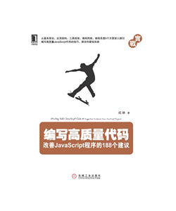

# 编写高质量代码 #

|  标　题 | 编写高质量代码               |
| ---: | :-------------------- |
|  副标题 | 改善JavaScript程序的188个建议 |
|  作　者 | 成林                    |
|  出版社 | 机械工业出版社               |
|  出版年 | 2012年11月              |
| ISBN | 9787111399056         |
| 推荐指数 | ★★★★☆                 |

## 封面 ##
 

## 目录 ##

+ 前言
+ 第1章　JavaScript语言基础
  - 建议1：警惕Unicode乱码
  - 建议2：正确辨析JavaScript句法中的词、句和段
  - 建议3：减少全局变量污染
  - 建议4：注意JavaScript数据类型的特殊性
  - 建议5：防止JavaScript自动插入分号
  - 建议6：正确处理JavaScript特殊值
  - 建议7：小心保留字的误用
  - 建议8：谨慎使用运算符
  - 建议9：不要信任hasOwnProperty
  - 建议10：谨记对象非空特性
  - 建议11：慎重使用伪数组
  - 建议12：避免使用with
  - 建议13：养成优化表达式的思维方式
  - 建议14：不要滥用eval
  - 建议15：避免使用continue
  - 建议16：防止switch贯穿
  - 建议17：块标志并非多余
  - 建议18：比较function语句和function表达式
  - 建议19：不要使用类型构造器
  - 建议20：不要使用new
  - 建议21：推荐提高循环性能的策略
  - 建议22：少用函数迭代
  - 建议23：推荐提高条件性能的策略
  - 建议24：优化if逻辑
  - 建议25：恰当选用if和switch
  - 建议26：小心if嵌套的思维陷阱
  - 建议27：小心if隐藏的Bug
  - 建议28：使用查表法提高条件检测的性能
  - 建议29：准确使用循环体
  - 建议30：使用递归模式
  - 建议31：使用迭代
  - 建议32：使用制表
  - 建议33：优化循环结构
+ 第2章　字符串、正则表达式和数组
  - 建议34：字符串是非值操作
  - 建议35：获取字节长度
  - 建议36：警惕字符串连接操作
  - 建议37：推荐使用replace
  - 建议38：正确认识正则表达式工作机制
  - 建议39：正确理解正则表达式回溯
  - 建议40：正确使用正则表达式分组
  - 建议41：正确使用正则表达式引用
  - 建议42：用好正则表达式静态值
  - 建议43：使用exec增强正则表达式功能
  - 建议44：正确使用原子组
  - 建议45：警惕嵌套量词和回溯失控
  - 建议46：提高正则表达式执行效率
  - 建议47：避免使用正则表达式的场景
  - 建议48：慎用正则表达式修剪字符串
  - 建议49：比较数组与对象同源特性
  - 建议50：正确检测数组类型
  - 建议51：理解数组长度的有限性和无限性
  - 建议52：建议使用splice删除数组
  - 建议53：小心使用数组维度
  - 建议54：增强数组排序的sort功能
  - 建议55：不要拘泥于数字下标
  - 建议56：使用arguments模拟重载
+ 第3章　函数式编程
  - 建议57：禁用Function构造函数
  - 建立58：灵活使用Arguments
  - 建议59：推荐动态调用函数
  - 建议60：比较函数调用模式
  - 建议61：使用闭包跨域开发
  - 建议62：在循环体和异步回调中慎重使用闭包
  - 建议63：比较函数调用和引用本质
  - 建议64：建议通过Function扩展类型
  - 建议65：比较函数的惰性求值与非惰性求值
  - 建议66：使用函数实现历史记录
  - 建议67：套用函数
  - 建议68：推荐使用链式语法
  - 建议69：使用模块化规避缺陷
  - 建议70：惰性实例化
  - 建议71：推荐分支函数
  - 建议72：惰性载入函数
  - 建议73：函数绑定有价值
  - 建议74：使用高阶函数
  - 建议75：函数柯里化
  - 建议76：要重视函数节流
  - 建议77：推荐作用域安全的构造函数
  - 建议78：正确理解执行上下文和作用域链
+ 第4章　面向对象编程
  - 建议79：参照Object构造体系分析prototype机制
  - 建议80：合理使用原型
  - 建议81：原型域链不是作用域链
  - 建议82：不要直接检索对象属性值
  - 建议83：使用原型委托
  - 建议84：防止原型反射
  - 建议85：谨慎处理对象的Scope
  - 建议86：使用面向对象模拟继承
  - 建议87：分辨this和function调用关系
  - 建议88：this是动态指针，不是静态引用
  - 建议89：正确应用this
  - 建议90：预防this误用的策略
  - 建议91：推荐使用构造函数原型模式定义类
  - 建议92：不建议使用原型继承
  - 建议93：推荐使用类继承
  - 建议94：建议使用封装类继承
  - 建议95：慎重使用实例继承
  - 建议96：避免使用复制继承
  - 建议97：推荐使用混合继承
  - 建议98：比较使用JavaScript多态、重载和覆盖
  - 建议99：建议主动封装类
  - 建议100：谨慎使用类的静态成员
  - 建议101：比较类的构造和析构特性
  - 建议102：使用享元类
  - 建议103：使用掺元类
  - 建议104：谨慎使用伪类
  - 建议105：比较单例的两种模式
+ 第5章　DOM编程
  - 建议106：建议先检测浏览器对DOM支持程度
  - 建议107：应理清HTML DOM加载流程
  - 建议108：谨慎访问DOM
  - 建议109：比较innerHTML与标准DOM方法
  - 建议110：警惕文档遍历中的空格Bug
  - 建议111：克隆节点比创建节点更好
  - 建议112：谨慎使用HTML集合
  - 建议113：用局部变量访问集合元素
  - 建议114：使用nextSibling抓取DOM
  - 建议115：实现DOM原型继承机制
  - 建议116：推荐使用CSS选择器
  - 建议117：减少DOM重绘和重排版次数
  - 建议118：使用DOM树结构托管事件
  - 建议119：使用定时器优化UI 队列
  - 建议120：使用定时器分解任务
  - 建议121：使用定时器限时运行代码
  - 建议122：推荐网页工人线程
+ 第6章　客户端编程 
  - 建议123：比较IE和W3C事件流
  - 建议124：设计鼠标拖放方案 
  - 建议125：设计鼠标指针定位方案 
  - 建议126：小心在元素内定位鼠标指针 
  - 建议127：妥善使用DOMContentLoaded事件 
  - 建议128：推荐使用beforeunload事件 
  - 建议129：自定义事件 
  - 建议130：从CSS样式表中抽取元素尺寸 
  - 建议131：慎重使用offsetWidth和offsetHeight 
  - 建议132：正确计算区域大小 
  - 建议133：谨慎计算滚动区域大小 
  - 建议134：避免计算窗口大小 
  - 建议135：正确获取绝对位置 
  - 建议136：正确获取相对位置 
+ 第7章　数据交互和存储 
  - 建议137：使用隐藏框架实现异步通信
  - 建议138：使用iframe实现异步通信 
  - 建议139：使用script实现异步通信
  - 建议140：正确理解JSONP异步通信协议 
  - 建议141：比较常用的服务器请求方法 
  - 建议142：比较常用的服务器发送数据方法
  - 建议143：避免使用XML格式进行通信 
  - 建议144：推荐使用JSON格式进行通信 
  - 建议145：慎重使用HTML格式进行通信 
  - 建议146：使用自定义格式进行通信 
  - 建议147：Ajax性能向导 
  - 建议148：使用本地存储数据 
  - 建议149：警惕基于DOM的跨域侵入 
  - 建议150：优化Ajax开发的最佳实践 
  - 建议151：数据存储要考虑访问速度 
  - 建议152：使用局部变量存储数据 
  - 建议153：警惕人为改变作用域链 
  - 建议154：慎重使用动态作用域 
  - 建议155：小心闭包导致内存泄漏 
  - 建议156：灵活使用Cookie存储长信息 
  - 建议157：推荐封装Cookie应用接口
+ 第8章　JavaScript引擎与兼容性
  - 建议158：比较主流浏览器内核解析
  - 建议159：推荐根据浏览器特性进行检测
  - 建议160：关注各种引擎对ECMAScript v3的分歧
  - 建议161：关注各种引擎对ECMAScript v3的补充
  - 建议162：关注各种引擎对Event解析的分歧
  - 建议163：关注各种引擎对DOM解析的分歧
  - 建议164：关注各种引擎对CSS渲染的分歧
+ 第9章　JavaScript编程规范和应用
  - 建议165：不要混淆JavaScript与浏览器
  - 建议166：掌握JavaScript预编译过程
  - 建议167：准确分析JavaScript执行顺序
  - 建议168：避免二次评估 
  - 建议169：建议使用直接量 
  - 建议170：不要让JavaScript引擎重复工作
  - 建议171：使用位操作符执行逻辑运算 
  - 建议172：推荐使用原生方法 
  - 建议173：编写无阻塞JavaScript脚本
  - 建议174：使脚本延迟执行 
  - 建议175：使用XHR脚本注入
  - 建议176：推荐最优化非阻塞模式
  - 建议177：避免深陷作用域访问
  - 建议178：推荐的JavaScript性能调优
  - 建议179：减少DOM操作中的Repaint和Reflow
  - 建议180：提高DOM访问效率
  - 建议181：使用 setTimeout实现工作线程
  - 建议182：使用 Web Worker
  - 建议183：避免内存泄漏
  - 建议184：使用SVG创建动态图形
  - 建议185：减少对象成员访问
  - 建议186：推荐100 ms用户体验
  - 建议187：使用接口解决JavaScript文件冲突
  - 建议188：避免JavaScript与CSS冲突

## 关联阅读 ##
1. [JavaScript 语言精粹（修订版） ★★★★☆](javascript-the-good-parts---phei-2012.md "JavaScript 语言精粹")
2. [JavaScript 启示录 ★★★★](javascript-enlightenment---ptpress-2014.md "JavaScript 启示录")
3. [JavaScript 核心技术 ★★☆](learning-javascript---cmpedu-2007.md  "JavaScript 核心技术")