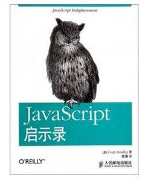

# JavaScript 启示录 #

|  标　题 | JavaScript 启示录                           |
| ---: | :--------------------------------------- |
|  原作名 | JavaScript Enlightenment                 |
|  作　者 | [林德利 Cody Lindley ](https://github.com/codylindley) |
|  译　者 | 徐涛                                       |
|  出版社 | 人民邮电出版社                                  |
|  出版年 | 2014年3月                                  |
| ISBN | 9787115334947                            |
| 推荐指数 | ★★★★                                     |

## 封面 ##

## 关于作者 ##

Cody Lindley 是一名客户端工程师（也称为前端开发人员）及flash开发者。他在 html、css、javascript、flash、客户端性能技术方面有丰富的工作经验（11年以上），这些技术都与web开发有关。如果他不在编写客户端代码，就很可能是在研究界面/交互设计，或是在准备创作材料以及在各种会议上要用的演讲稿。当他不坐在电脑前时，他肯定正和他的妻子和孩子在爱达荷州的博伊西游玩，他们在博伊西可以进行三项全能运动训练、滑雪、骑山地自行车和公路自行车、登山、阅读、看电影或者讨论基督教世界观的理论依据。

## 关于译者 ##

徐涛（网名：汤姆大叔；微博：@tomxutao），微软最有价值专家（mvp）、项目经理、软件架构师，擅长大型互联网产品的架构与设计，崇尚敏捷开发模式，熟悉设计模式、前端技术、以及各种开源产品，曾获mcp、mcse、mcdba、mcts、mcitp、mcpd、pmp认证。《javascript编程精解》译者，博客地址：http://www.cnblogs.com/tomxu。

## 目录 ##

+ 第1章 javascript对象
  - 1.1 创建对象
  - 1.2 javascript构造函数构建并返回对象实例
  - 1.3 javascript原生/内置对象构造函数
  - 1.4 用户自定义/非原生对象构造函数
  - 1.5 使用new操作符实例化构造函数
  - 1.6 从构造函数创建字面量值
  - 1.7 原始值(或简单值)
  - 1.8 null、undefined、“string”、10、true和false等原始值不是对象
  - 1.9 如何存储和复制原始值
  - 1.10 原始值比较采用值比较
  - 1.11 原始值(string、number、boolean)在被用做对象时就像对象
  - 1.12 复杂值(或组合值)
  - 1.13 如何存储或复制复杂值
  - 1.14 复杂对象比较采用引用比较
  - 1.15 复杂对象具有动态属性
  - 1.16 typeof操作符
  - 1.17 动态属性支持易变对象
  - 1.18 构造函数实例都拥有指向其构造函数的constructor属性
  - 1.19 验证对象是否是特定构造函数的实例
  - 1.20 构造函数创建的实例可拥有自己独立的属性(实例属性)
  - 1.21 javascript对象和object()对象
+ 第2章 对象与属性
  - 2.1 复杂对象可以将大多数javascript值作为属性
  - 2.2 封装复杂对象
  - 2.3 用点表示法或中括号表示法获取/设置/更新对象属性
  - 2.4 删除对象属性
  - 2.5 如何解决对象属性的引用
  - 2.6 使用hasownproperty验证对象属性不是来自原型链
  - 2.7 使用in操作符检查一个对象是否包含给定属性
  - 2.8 使用for in循环枚举(循环遍历)对象的属性
  - 2.9 宿主对象与原生对象
  - 2.10 使用underscore.js增强及扩展对象
+ 第3章 object()
  - 3.1 object()对象概要
  - 3.2 object()参数
  - 3.3 object()属性和方法
  - 3.4 object()对象实例属性和方法
  - 3.5 使用对象字面量创建object()对象
  - 3.6 所有对象都继承自object.prototype
+ 第4章 function()
  - 4.1 function()对象概要
  - 4.2 function()参数
  - 4.3 function()属性和方法
  - 4.4 function对象实例属性和方法
  - 4.5 函数总有返回值
  - 4.6 函数是“一等公民”(不仅语法，还有值)
  - 4.7 函数的参数传递
  - 4.8 this和arguments适用于所有函数
  - 4.9 arguments.callee属性
  - 4.10 函数实例的length属性和arguments.length
  - 4.11 重定义函数参数
  - 4.12 代码执行完成前取消函数执行
  - 4.13 定义函数(语句、表达式或构造函数)
  - 4.14 调用函数[函数、方法、构造函数或call()和apply()]
  - 4.15 匿名函数
  - 4.16 自调用的函数表达式
  - 4.17 自调用的匿名函数语句
  - 4.18 函数可以嵌套
  - 4.19 给函数传递函数，从函数返回函数
  - 4.20 函数定义之前调用(函数提升)
  - 4.21 函数可以调用自身(递归)
+ 第5章 head/全局对象
  - 5.1 head/全局对象概要
  - 5.2 head对象内的全局函数
  - 5.3 head对象与全局属性、全局变量
  - 5.4 引用head对象
  - 5.5 head对象是隐式的，通常不显式引用
+ 第6章 this关键字
  - 6.1　this概要及this如何引用对象
  - 6.2 如何确定this值
  - 6.3 在嵌套函数中用this关键字引用head对象
  - 6.4 充分利用作用域链研究嵌套函数问题 
  - 6.5 使用call()或apply()控制this值 
  - 6.6 在用户自定义构造函数内部使用this关键字 
  - 6.7 原型方法内的this关键字引用构造函数实例 
+ 第7章 作用域和闭包 
  - 7.1 javascript作用域概要 
  - 7.2 javascript没有块作用域 
  - 7.3 在函数中用var声明变量，避免作用域陷阱 
  - 7.4 作用域链(词法作用域) 
  - 7.5 作用域链查找返回第一轮值 
  - 7.6 函数定义时确定作用域，而非调用时确定
  - 7.7 闭包是由作用域链引起的 
+ 第8章 函数原型属性 
  - 8.1 原型链概要 
  - 8.2 为何要关注prototype属性 
  - 8.3 原型在所有function()实例上都是标准的 
  - 8.4 默认的prototype属性是object()对象 
  - 8.5 将构造函数创建的实例链接至构造函数的prototype属性 
  - 8.6 原型链的最后是object.prototype 
  - 8.7 原型链返回在链中找到的第一个匹配结果 
  - 8.8 用新对象替换prototype属性会删除默认构造函数属性 
  - 8.9 继承原型属性的实例总是能够获得最新值 
  - 8.10 用新对象替换prototype属性不会更新以前的实例 
  - 8.11 用户自定义构造函数像原生构造函数一样原型继承 
  - 8.12 创建继承链 
+ 第9章 array() 
  - 9.1 array()对象概要 
  - 9.2 array()参数 
  - 9.3 array()属性和方法 
  - 9.4 数组对象实例属性和方法 
  - 9.5 创建数组 
  - 9.6 数组添加及更新 
  - 9.7 长度与索引 
  - 9.8 定义预定义长度的数组 
  - 9.9 可以通过设置数组长度添加或删除值 
  - 9.10 数组包含数组(多维数组) 
  - 9.11 遍历数组
+ 第10章 string() 
  - 10.1 string()对象概要 
  - 10.2 string()参数 
  - 10.3 string()属性和方法 
  - 10.4 字符串对象实例属性和方法 
+ 第11章 number()
  - 11.1 number()对象概要 
  - 11.2 整数和浮点数
  - 11.3 number()参数 
  - 11.4 number()属性 
  - 11.5 数字对象实例属性和方法 
+ 第12章 boolean()
  - 12.1 boolean()对象概要
  - 12.2 boolean()参数
  - 12.3 boolean()属性和方法
  - 12.4 布尔对象实例属性和方法 
  - 12.5 非原始false布尔对象转换为true 
  - 12.6 某些值是false，其他都是true 
+ 第13章 使用原始值：字符串、数字和布尔值 
  - 13.1 访问属性时原始值/字面量值被转换为对象
  - 13.2 通常应使用原始字符串、数字和布尔值 
+ 第14章 null
  - 14.1 null值概要 
  - 14.2 typeof(null)的返回值为“object” 
+ 第15章 undefined 
  - 15.1 undefined值概要
  - 15.2 在全局作用域中定义undefined变量
+ 第16章 math函数
  - 16.1 内置math对象概要
  - 16.2 math属性和方法
  - 16.3 math不是构造函数
  - 16.4 math常数无法增大/改变
+ 附录a 回顾
+ 附录b 总结

## 评价摘录 ##

+ **分享编程入门指南**：力图在有限的篇幅内，通过考察原生JavaScript对象和所支持的细微差别，来给读者展现准确的JavaScript世界观，涉及对象、属性、复杂值、原始值、作用域、继承、this关键字、head对象等重要概念。本书帮助读者厘清这些概念，进而掌握应用它们的技术和技巧。（简书作者 分享编程入门指南，[简书](http://www.jianshu.com/p/80b3529c2b86)）

+ **郭志敏**：本书无关于JavaScript设计模式，也无关于JavaScript面向对象代码实现。本书的写作目的也不是鉴别JavaScript语言特点的好坏。本书并不是一本完整的参考指南。它面向的读者人群并不是编程新手或对JavaScript完全陌生的人员。同时，它也不是一本JavaScript攻略手册。关于上述这些方面的书籍都已经面世。（知乎作者 郭志敏，[知乎](http://zhuanlan.zhihu.com/p/19674660)）

## 关联阅读 ##
1. [JavaScript 语言精粹（修订版）](javascript-the-good-parts---phei-2012.md "JavaScript 语言精粹")
2. [编写高质量代码：改善 JavaScript 程序的188个建议]( javascript-188---cmpedu-2012.md"编写高质量代码：改善 JavaScript 程序的188个建议")
3. [JavaScript 核心技术](learning-javascript---cmpedu-2007.md  "JavaScript 核心技术")