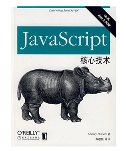

# JavaScript 核心技术 #

|  标　题 | JavaScript 核心技术                          |
| ---: | :--------------------------------------- |
|  原作名 | Learning JavaScript                      |
|  作　者 | [(美) Shelley Powers ](https://en.wikipedia.org/wiki/Shelley_Powers) |
|  译　者 | 苏敬凯                                      |
|  出版社 | 机械工业出版社                                  |
|  出版年 | 2007年6月                                  |
| ISBN | 9787111212973                            |
| 推荐指数 | ★★☆                                      |

**注意，该书第二版中译名为《JavaScript 学习手册(第二版)》**

## 封面 ##

## 关于作者 ##
Shelley Powers 在实践中应用 Web 技术并发表各种与 Web 技术有关的文章已经长达 13 年之久。她最近在 O'Reilly 出版的书涉及语义 Web、Ajax、JavaScript 和 Web 图形等多个领域。她还是狂热的业余摄影师，同时也是 Web 开发的狂热爱好者。

## 目录 ##

+ 前言
+ 第1章　JavaScript初探
  - 1.1　规范和实现相互交织的历史
  - 1.2　跨浏览器的不兼容性和其他常见的JavaScript传说
  - 1.3　你能用JavaScript来做什么
  - 1.4　JavaScript初探：“HelloWorld！”
  - 1.5　JavaScript沙箱
  - 1.6　可访问性和JavaScript的最佳实践
+ 第2章　JavaScript数据类型与变量
  - 2.1　变量的标识
  - 2.2　作用域
  - 2.3　简单类型
  - 2.4　常量：有名称但不改变
  - 2.5　习题
+ 第3章　运算符和语句
  - 3.1　JavaScript语句的格式
  - 3.2　简单语句
  - 3.3　条件语句和程序流
  - 3.4　条件运算符
  - 3.5　逻辑运算符
  - 3.6　高级语句：循环语句
  - 3.7　习题
+ 第4章　JavaScript对象
  - 4.1　对象构造函数
  - 4.2　Number对象
  - 4.3　String对象
  - 4.4　正则表达式与RegExp
  - 4.5　有专门用途的对象：Date和Math
  - 4.6　JavaScript数组
  - 4.7　关联数组：不是数组的数组
  - 4.8　习题
+ 第5章　函数
  - 5.1　定义函数：细数所有方式
  - 5.2　回调函数
  - 5.3　函数和递归
  - 5.4　嵌套函数、函数闭包和内存泄漏
  - 5.5　作为对象的函数
  - 5.6　习题
+ 第6章　捕捉事件
  - 6.1　O级DOM上的事件句柄
  - 6.2　2级DOM上的事件句柄
  - 6.3　产生事件
  - 6.4　习题
+ 第7章　表单与即时验证
  - 7.1　访问表单
  - 7.2　把事件附加在表单上：不同的方法
  - 7.3　选择列表
  - 7.4　单选按钮和复选框
  - 7.5　输入字段和JiT正则表达式
  - 7.6　习题
+ 第8章　沙箱及之上的cookie、连通性和隐私
+ 第9章　基础浏览器对象
+ 第10章　DOM：文档对象模型
+ 第11章　创建定制的JavaScript对象
+ 第12章　构建动态网页：在脚本中加入样式
+ 第13章　使用Ajax
+ 第14章　好消息：生动的程序库！令人惊异的Web服务！有趣的API！
+ 附录　习题答案

## 关联阅读 ##
1. [JavaScript 语言精粹（修订版）](javascript-the-good-parts---phei-2012.md "JavaScript 语言精粹")
2. [JavaScript 启示录](javascript-enlightenment---ptpress-2014.md "JavaScript 启示录")
3. [编写高质量代码：改善 JavaScript 程序的188个建议]( javascript-188---cmpedu-2012.md"编写高质量代码：改善 JavaScript 程序的188个建议")