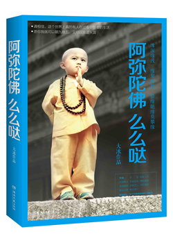

# 阿弥陀佛么么哒 #

|标　题|阿弥陀佛么么哒|
|----:|:-------|
|作　者|[大冰](http://baike.baidu.com/link?url=8wSOp0vLcmUtfqQMhgBxfGaXvKzS3_l29ErhOWwM5-NEHcnaxTqFOwVa-0gEnQJepdTUZRsZdryObxVWlGWUla)|
|出版社|湖南文艺出版社|
|出版年|2015年6月|
|ISBN|9787540472238|
|推荐指数|★★★|

## 封面 ##

## 目录 ##

+ 一个孩子的心愿
+ 一百万个祝福
+ 我有故事，你有酒吗？
+ 我的王八蛋
+ 玩儿鲨鱼的女人
+ 凭什么
+ 送你一只喵
+ 厦门爱情故事2007
+ 周三的情书
+ 铃铛
+ 小善缘
+ 后记

## 评价摘录 ##

+ **逆风飞扬风筝梦**：越阳的故事，小s边工作边旅游，老谢的执着与善良，王继阳和他的小猫，毛毛和木头的爱情，周三的情书，小师姐的铃铛声……还有让人羡慕嫉妒恨有希有和老张那样的朋友!每读完一个故事让人或是深思，或是感动，或是泪流，或是大笑，偶有无奈和些许落寞…在这个浮躁虚华的世间，能用如此精炼的字词写出真实感人深思的文字，实属难能可贵!（简书作者 逆风飞扬风筝梦，[简书](http://www.jianshu.com/p/9879b147049a)）

+ **笑东风**：本来对大冰没什么感觉的，一个很好的朋友喜欢，推荐，我看了几篇，觉得不对味，就没有再看了。我知道他在写真实的故事，至少让人觉得是，但是，我能看出哪些是“艺术加工”过的，而且加工痕迹很明显。。。我有要去求证的冲动，哦，看的是《乖，摸摸头》。后来朋友说他在百城百校的演讲，还带了一份礼物，就是新作《乖，摸摸头》（不是每人送一本，而是让小伙伴们知道世间有这样一本好书在），并特别强调，来讲是因为缘分，并不是推荐新书，因为新书已经畅销榜上前几名了，没必要这样做，来就是单纯送故事的，送不一样的人生体验的。嗯，好像哪里不对，隐隐有种欲盖弥彰的味道。（知乎作者 笑东风，[知乎](https://www.zhihu.com/question/33060314/answer/59528487)）

+ **L小姐**：对比前两本，我觉得是有些江郎才尽，或者说创作遇到了瓶颈，叙事风格一如前往，带着江湖习气。…… 总而言之，这本书比起前两本惊喜不多。我花了一晚上就看完了，就如他自己而言，毕竟是野生作家，文字经不起太大的推敲，很多都可以匆匆一带而过。不过，三本书还是对我有影响，既可以朝九晚五，又可以浪迹天涯。读万卷书，不如行万里路。不远的将来，我也会去远方走走看看。（知乎作者 L小姐，[知乎](https://www.zhihu.com/question/33060314/answer/59569744)）

## 关联阅读 ##

0. [他们最幸福 ★★★][ta-men-zui-xin-fu---hl&ahp-2013]
0. [乖，摸摸头 ★★★][guai-mo-mo-tou---hl&ahp-2014]

[ta-men-zui-xin-fu---hl&ahp-2013]: ta-men-zui-xin-fu---hl&ahp-2013.md "他们最幸福"
[guai-mo-mo-tou---hl&ahp-2014]: guai-mo-mo-tou---hl&ahp-2014.md "乖，摸摸头"
