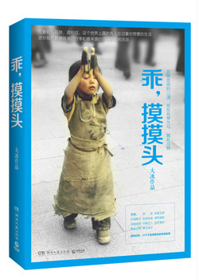

# 乖，摸摸头 #

|  标　题 | 乖，摸摸头                                    |
| ---: | :--------------------------------------- |
|  作　者 | [大冰](http://baike.baidu.com/link?url=8wSOp0vLcmUtfqQMhgBxfGaXvKzS3_l29ErhOWwM5-NEHcnaxTqFOwVa-0gEnQJepdTUZRsZdryObxVWlGWUla) |
|  出版社 | 湖南文艺出版社                                  |
|  出版年 | 2014年9月                                  |
| ISBN | 9787540468798                            |
| 推荐指数 | ★★★                                      |

## 封面 ##

## 目录 ##

+ 乖，摸摸头
+ 我有一碗酒，可以慰风尘
+ 对不起
+ 普通朋友
+ 不许哭
+ 唱歌的人不许掉眼泪
+ 听歌的人不许掉眼泪
+ 一个叫木头，一个叫马尾
+ 椰子姑娘漂流记
+ 风马少年
+ 小因果
+ 我的师弟不是人
+ 后记

## 评价摘录 ##

+ **lotusblue**：三千鸡汤取这一瓢饮。轻松翻完的大众读物，12段别人的传奇人生，有越战老兵、流浪歌手、还有各色文艺姑娘。或许作者真如他笔下自诩的现代游侠，想要抒发以梦为马的情怀，但行文却让人如此的不舒服，八尺的汉子，三毛的口吻，四处抖落优越感。此书治好了很多小读者的游侠江湖瘾和文艺公主梦。（豆瓣用户 lotusblue，[豆瓣](https://www.douban.com/people/longyang/)）

+ **麦嘉**：但是就本人来讲，大冰这本书还是值得一读的。它的可读性在于为我们这些整天窝在象牙塔里心中窥伺着外面世界却无法停止循规蹈矩的脚步的学生们带来的心潮澎湃之感。留意到书评里面有一个高中生觉得看过之后活力满满很兴奋，那么这本书就值得高中生们一看，因为它至少给会时常产生消极怠工状态的学生们带来哪怕那么一丝丝的正能量，让他们产生了愉悦感，足矣。（知乎作者 麦嘉，[知乎](https://www.zhihu.com/question/26412393/answer/39928302)）

+ **敖御风**：书名就很赞，来，乖，摸摸头。封面也很赞，磕长头的藏族小女孩，表情虔诚且平静。1.没有什么过不去，只是再也回不去，哭什么哭，乖，摸摸头。2.文字就像隔空伸出的一只手，乖，摸摸头，看书的时候岂不是就被摸摸头了，哈哈。…… 基本上都是睡觉之前看一会，早上起床的时候看一会，然后，就看完了，算是睡前读物+晨起读物。有时候晚上看了之后也会失眠，比如昨天晚上，挨到了快三点才睡着。（知乎作者 敖御风，[知乎](https://www.zhihu.com/question/26412393/answer/55304221)）

## 关联阅读 ##

1. [他们最幸福 ★★★](ta-men-zui-xin-fu---hl&amp;ahp-2013.md "他们最幸福")
2. [阿弥陀佛么么哒 ★★★](e-mo-tuo-fo-me-me-da---hl&ahp-2015.md "阿弥陀佛么么哒")