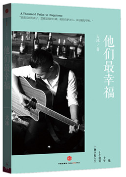

# 他们最幸福 #

|  标　题 | 他们最幸福                                    |
| ---: | :--------------------------------------- |
|  作　者 | [大冰](http://baike.baidu.com/link?url=8wSOp0vLcmUtfqQMhgBxfGaXvKzS3_l29ErhOWwM5-NEHcnaxTqFOwVa-0gEnQJepdTUZRsZdryObxVWlGWUla) |
|  出版社 | 湖南文艺出版社                                  |
|  出版年 | 2013年9月                                  |
| ISBN | 9787508641577                            |
| 推荐指数 | ★★★                                      |

## 封面 ##

## 目录 ##

+ 序言 有梦为马
+ 伴我行天涯
+ 流浪歌手的情人
+ 送你一颗糖
+ 越狱者
+ 西藏往事
+ 不用手机的女孩儿
+ 想把我唱给你听
+ 预约你的墓志铭
+ 到死之前，我们都是需要发育的孩子
+ 艽野羌塘，尘梦凤凰
+ 后记 陪我到可可西里去看海

## 评价摘录 ##

+ **Cookie**：无意中看到大冰的一席演讲才知道他主持人之外另外几重更主要的身份。关注了他作为民谣歌手的音乐人小站，看了他写的书，打算去他的酒吧。他到底是怎样的人不重要，重要的是他让我看到这样一个人：这个人走过万里路，阅过无数人，把生活过成了一次旅行，把日子度成了一本书。感谢。（豆瓣用户 Cookie，[豆瓣](https://www.douban.com/people/Leafior/)）

+ **雨熙遇安Solecity_**：去年11月看过了大冰的《乖，摸摸头》，那时才知道，原来生活中真的有那么多随性而活的人们存在着，他们没有朝九晚五的规定，也不需要担心世俗的烦恼，他们只信奉着自己的信仰，以自己最想要的状态于这个世界生活着。他们脱离了物质，以另一种方式追求着自己的幸福。（简书作者 雨熙遇安Solecity_，[简书](http://www.jianshu.com/p/ef3c4c383ecf)）

+ **思遥** 所有问题并不是幸福在哪里，而是什么是幸福。有人跋涉山林，有人静守山丘；有人策马草原，有人圈在磨旁。喜乐自得，甘苦自知。每种生活都得被磕碰、打磨，难免起起伏伏。选择哪种生活并不困难，抓住一个标准，那就是找出一个让自己信服的理由。幸福呢，有太多种。不苛责别人，更别苛责自己，幸福就触手可及。（简书作者 思遥，[简书](http://www.jianshu.com/p/1a141f3e176c)）

+ **敖御风**：唯有内心强大才是真正的强大。大冰书里的人都是幸福的，也许他们的生活状态不太符合主流的价值观，但他们内心幸福而安宁的精神状态确是你我不曾具备的。…… 最后是书里特别喜欢的一句话：若你还年轻，若身旁这个世界不是你想要的，你敢不敢沸腾一下血液，可不可以绑紧鞋带重新上路，敢不敢去寻觅那些能让自己内心强大的力量。（知乎用户 敖御风，[知乎](https://www.zhihu.com/question/22345417/answer/55304337)）

## 关联阅读 ##

1. [乖，摸摸头 ★★★](guai-mo-mo-tou---hl&amp;ahp-2014.md	"乖，摸摸头")
2. [阿弥陀佛么么哒 ★★★](e-mo-tuo-fo-me-me-da---hl&ahp-2015.md"阿弥陀佛么么哒")