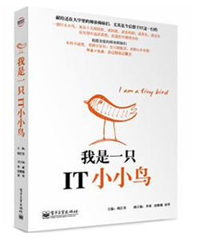
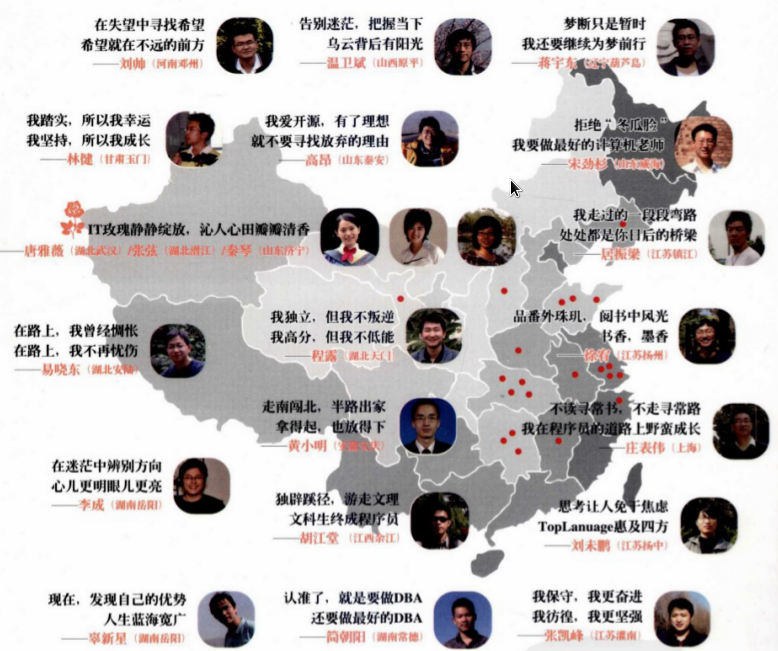

# 我是一只IT小小鸟 #

|  标　题 | 我是一只IT小小鸟                                |
| ---: | :--------------------------------------- |
|  主　编 | 胡江堂                                      |
|  作　者 | 李　成 / 唐雅薇 / 秦　琴 / 蒋宇东 /  刘未鹏 / 居振梁 / 刘　帅 / 温卫斌 /  张　弦 / 张凯峰 / 庄表伟 / 宋劲杉 /  程　露 / 黄小明 / 易晓东 / 简朝阳 /  林　健 / 高　昂 / 徐　宥 / 辜新星 |
|  出版社 | 电子工业出版社                                  |
|  出版年 | 2009年9月                                  |
| ISBN | 9787121095092                            |
| 推荐指数 | ★★★★                                     |

## 封面 ##

## 作者简介 ##
1. 蒋宇东 现就职于上海某公司（C++程序员）博客：http://blog.csdn.net/NewNebuladream
2. 居振梁 博客：http://wargrey.yo2.cn
3. 刘帅 现就职于Amazon（SDE-Test）博客：http://lsthu.spaces.live.com/
4. 李成 现就职于北京飞维美地信息技术有限公司（软件工程师）博客：http://www.perlfect.org
5. 温卫斌 现就职于中国农业银行软件开发中心 博客：http://terry-pekingssm.spaces.live.com
6. 胡江堂 现就职于赛诺菲巴斯德（SAS程序员）博客：http://li-and-jiang.com/blog/
7. 辜新星 现就职于Google（助理产品经理）博客：http://guxinxing.blogbus.com/
8. 刘未鹏 现就职于微软亚洲研究院（程序员）博客：http://mindhacks.cn
9. 唐雅薇 现就职于IBM中国研发中心（上海）博客：http://cubbyvivi.blogbus.com/
10. 张弦 现就职于百度（软件工程师）博客：http://stonefish9.blogbus.com/
11. 秦琴 现就职于中国银行 博客：http://clalietsin.spaces.live.com/
12. 张凯峰 现就职于IBM中国软件开发中心（软件工程师）博客：http://www.zhangkf.com
13. 庄表伟 博客：http://www.zhuangbiaowei.cn
14. 宋劲杉 现就职于北京亚嵌教育研究中心（讲师）博客：http://songjinshan.is-programmer.com
15. 程露 博客：http://roburite.spaces.live.com/
16. 黄小明 现就职于某外资企业（软件开发及项目管理）博客：http://blog.csdn.net/view1024
17. 易晓东 现就职于某电子商务网站（运营负责人）博客：http://planeboy.blogbus.com/
18. 简朝阳 现就职于阿里巴巴（MySQL & Oracle DBA）博客：http://www.jianzhaoyang.com
19. 林健 现于中国科学院计算技术研究所就读（硕博连读）博客：http://blog.linjian.org
20. 高昂 现于中科院地理所攻读博士学位 博客：http://www.gaoang.com/
21. 徐宥 现于Washington University 就读（博士）博客：http://blog.youxu.info

## 目录 ##

+ 推荐序一
+ 推荐序二
+ 序
+ 蒋宇东 梦断计院，为梦前行
  - 引子：我的感悟，我的忏悔
  - 上篇·梦断计院
    * 计院的第一大问题——学生普遍基础薄弱
    * 计院的第二大问题——学风不正，涣散成性
    * 计院第三大问题——实践环节薄弱，人才位置错放
  - 下篇·为梦前行
    * 问自己——这个专业到底要学什么
    * 为了心中的理想拼搏——准备编程竞赛
    * 在新东方，我发现自己是井底之蛙
  - 结语：我想对师弟师妹们说
+ 居振梁 我的弯路，你的桥梁
  - 引子：让我的弯路，成为你的桥梁
  - 中学篇 定调：兴趣指路，惜无良师点拨
    * 文曲星让我邂逅编程
    * 不懂平衡术，高考付代价
  - 大学篇 定调：很想成事，天时地利不够，尚缺人和
    * 年轻气盛，好心助人被误作秀
    * 与师为友，我是“正当逃课一族”
    * 与师为伴，做项目练手练心
    * 组建团队，苦辣酸甜
  - 结语：我还年轻，路很长
+ 刘帅，在失望中寻找希望
  - 引子：失望中有希望么
  - 本科四年 定调：迷迷糊糊、庸庸碌碌地拿着奖学金
    * 我是科班——却没学懂计算机
    * 震撼：在清华听朱仲涛老师的“数据结构”课
  - 考研·读研 定调：开始改变思维习惯，化机械记忆为主动思考
    * 若只有机械思维——上了清华又如何
  - 实习之门 定调：快想，快说，快干
    * IBM实习：和以前的工作不一样呢
  - 求职之路 定调：再次痛感基本功的重要
    * “完美时空”面试的不完美经历——崩溃之余也反思
  - 结语：总能看见希望的亮光
+ 李成，北大七年，我的找补之路
  - 引子：非典型科班生
  - 本科四年 定调：年少轻狂，60分万岁
    * 最后悔没抓住的时光
  - 考研·读研 定调：一心找补，开始独立思考
    * 痛苦的追赶之路
  - 实习之门 定调：继续找补，早走一步，多走一步
  - 求职之路 定调：坚定地执行不投原则
    * 尘埃落定：去创业公司赌一把
  - 结语：小公司VS大公司
+ 温卫斌，把握改变契机：告别迷茫
  - 引子：人生如画卷
  - 本科四年 定调：初始迷茫，梦醒后奋发努力
    * 同学早逝——惊醒梦中的我
    * 生命的追问——赎罪般地用功学习
  - 考研·读研 定调：非科班出身，化压力为动力，积极实践
    * 非科班出身：重基础，也重方向
  - 实习之门 定调：实践个人兴趣，不断获得提升
    * 实习岗位：没有完美，只有合适
  - 求职之路 定调：跌跌撞撞，在失败中反思
    * 求职接连被拒，为什么？
  - 结语：展开人生的画卷
+ 胡江堂，未走过的路——从文科生到SAS程序员
  - 引子：背景复杂得一塌糊涂
  - 本科四年 定调：难免浮躁，但积极向最好的地方靠拢
  - 考研·读研 定调：发现SAS，我找准专业定位
    * 考研，从CCER到北大软院
    * 发现SAS
    * 从交流中获得帮助
    * 专业学习经验谈
  - 实习之门 定调：一门心思做SAS，越来越Strong
    * 我在SAS中国研发中心的日子
  - 求职之路 定调：实习经验吸引猎头，求职水到渠成
    * 求职故事——赛诺菲巴斯德（Sanofi Pasteur）
    * 求职经验谈
  - 结语：诸多折腾，喜剧收场
+ 辜新星 时刻调整方向：找到人生的蓝海
  - 引子：骑单车的故事
  - 本科四年 定调：大一有点瞎忙，而后自己做主
    * 大一我是社团狂
    * 好学长赐我财富
    * 理解专业，痛并快乐着
    * 我和侯捷老师的忘年交
  - 求职之路 定调：结合兴趣，目标明确，准备充分，一举中的
    * 确立求职目标：IT业的产品经理和管理咨询业的分析师
    * 为求职目标做好各种准备
    * 简历不是写出来的，是改出来的
    * 我的面试故事
    * 兴趣是我全身心工作的基础
  - 结语：骑单车快乐向前
+ 刘未鹏 我在南大的七年
  - 引子：父亲教我的事
  - 大一：两次歪打正着
    * 学数学打下基本功
    * 与C++结下不解之缘
  - 大二：步入技术写作之路
    * 在《程序员》上发表第一篇文章
    * 开设博客“C++的罗浮宫”
  - 大三～大四：在软院度过的两年
    * 英文原版书为我打开一扇窗
    * 基本功不过硬，面试微软失败
  - 考研故事：第二次终于成功了
  - 读研：阅读交流，开拓眼界
    * 如何思考，如何正确地思考
    * 有意识地准备英语，弥补短板
  - 结语：多了两年总算不晚
  - 刘未鹏的书架
+ 唐雅薇 再难也要向前爬
  - 引子：我是普通女生
  - 本科四年 定调：把握自己，向往外面的世界
    * 前传：一直都是乖乖女
    * 初入大学：努力追赶，我只比你们慢三年
  - 考研·读研 定调：起初迷茫，但思考之门已开，行动更加迅速
    * 放弃保研：我要自己做主
    * 考研失利，调剂不放弃：去名校学习，睡觉也能进步
  - 实习之门 定调：有泪有欢笑，心智更成熟
    * 我和IBM的三次邂逅——想说爱你不容易
    * 我的实习心得
  - 求职之路 定调：不打无准备之仗，但准备还是不足
    * 找准个人定位：迈出求职第一步
    * 调研很重要：确立大方向
    * 我的面试故事
    * 我的求职技巧
  - 结语：收获与遗憾——写给未来的自己
+ 张弦 发挥优势，我在逆风中追梦
  - 引子：纪念那些苦闷和挣扎
  - 求学的三段弯路：休学，退学，复学
    * 高三，休学半年
    * 大二，休学半年
    * 对教育的简单思考，让我选择了退学
    * 父母无条件的爱，让我恢复平静
  - 逆境中的坚持：我要考研
    * 非科班出身，我要如何竞争？
    * 实习之门 定调：加大编码量，攻克算法关
    * 我的外包项目实战故事
  - 结语：力有所及，助人为乐
+ 秦琴 认识生活的真相，从容秀出自我
  - 引子：走进软院——我充满期待
  - 本科四年 定调：为就业而选专业，理性看待出国
    * GPA：不爱好也不放弃
    * 理性看待出国
  - 考研·读研 定调：来到北京，视野大开
  - 实习之门 定调：一定要实习，弥补本科阶段的遗憾
    * 自信从容，秀出特长——我这样拿到实习Offer
    * 适应环境，实习期间我不再午睡
    * 难忘的社会实践——成为奥运会志愿者
  - 求职之路 定调：为自己理想中的工作而努力
    * 我的银行面试故事
  - 结语：先有生存的资本，而后才是兴趣
+ 张凯峰 一路走来，70后的反思与成长
  - 引子：70后的矛盾与窘境
  - 本科四年 定调：迷茫着不敢太放松，没挂红灯，也没大的突破
    * 学做PPT，我的电脑梦开始飞翔
    * 接触MIS，让我走上软件开发之路
  - 考研·读研 定调：一开始选错了专业方向，勇于沟通，改变了命运
  - 实习之门 定调：初次品尝做乙方的滋味
    * 深圳的实习故事
  - 工作之路 定调：保守中有进取，浮躁中有反思，从未停下脚步
    * 我的第一份工作：北大方正
    * 我的第二份工作：IBM
    * 从泡社区到写译——我的成长契机
  - 结语：70后，我们还有机会
+ 庄表伟 不走寻常路，我的野蛮成长
  - 引子：10岁，确定计算机是我的最爱
  - 计算机让我玩兴大发
  - 我是编程快枪手，也是半个计算机老师
  - 从第一桶金到项目经理
  - 未完成的破解任务——我的优秀毕业论文
  - 软件开发的目标变化
  - 多语言混合编程——未来的趋势
  - 结语：野蛮成长启示录
+ 宋劲杉 不让学生重走我的弯路
  - 引子：当年的兴趣班，计算机初体验
  - 本科四年 定调：一直在跟风，学过也茫然
    * 懵懂跟风——不交流使我落后
  - 读研阶段 定调：终于找到目标，扎扎实实打基础
    * 收心学习——收获多多，全力追赶
  - 结语：不让学生重走我的弯路
+ 程露 路怎么走，我自己挑
  - 引子：东湖之滨，珞珈山上，难忘我的武大六年
  - 本科四年 定调：也自学，也逃课；追求高分，但绝不低能
    * 理性看待大学生活，不抱幻想
    * 大二才当“武大郎”，规定自己得高分
    * 好老师在哪儿？大二没入编程的门
    * 教与学——我的几点浅见
    * 参加数学建模大赛，重新爱上编程
  - 保研·读研 定调：没有走既定的路，选择了未知的路
    * 误听小道消息，错过中科院保研
    * 当小硕，半年做出了一点小成果
  - 求职之路 定调：临时抱佛脚，苦练小宇宙
    * 制定严格计划，大补IT，准备出山
  - 结语：Open的人生充满希望
+ 黄小明 半路出家，从化验员到程序员
  - 引子：赶上了毕业生不再包分配的第一年
  - 本科四年 定调：目标明确，一入学就关注自己将来找什么样的工作
    * 每天看报纸，收集和分析就业信息
    * 当记者，入社团，搞零售——积累社会实践经验
  - 放弃本校保研，奔赴经济发达的广东
  - 工作七年 定调：主动转行，半路出家，投身IT
    * 努力自学编程，一心想转行
  - 琢磨考研：我需要新的成长空间
  - 考研·读研 定调：得来不易，非常珍惜学习机会
  - 再度求职：找到适合自己的岗位
  - 结语：不断总结，永远沟通
+ 易哓东 在书与互联网的世界里成长
  - 引子：梦开始的地方
    * 童年，与书结缘
    * 临时抱佛脚，跨过高考独木桥
    * 《电脑报》让我初识互联网
    * 蛰伏——即使有信心，斗志却抑止
    * 结识同好，创办Tomcat521.com网站
  - 考研·读研 定调：重回大学校园，出书上电视，丰富多彩
    * 工作三年后，准备考研
  - 突遭人生巨变：兄长遇难
  - 军事爱好连谱佳话：上电视，出主题书
    * 找工作，结缘武汉博文
    * 上海滩，我来了
    * 入职第一个月，惨遭修理
    * 危机，让我学会了从公司角度看问题
    * 适应变革，放手一搏
  - 结语：分享那些好书
+ 简朝阳 在交流中学习，在分享中进步
  - 引子：交流，分享，我成长的关键词
  - 本科四年 定调：不爱本专业，心在计算机。师兄领进门，修行靠实践
    * 迷电脑，入科协，初识MySQL数据库
    * “笨小孩”引路，我迷上了数据库
  - 求职之路 定调：有过不少挣扎，但最终认准IT行业，就是要做DBA
    * 几经思考，确定投身IT
    * 就是要做DBA，终于如愿
    * 先做实习生——跟着“师傅”大受益
    * 阿里DBA Team——继续我的MySQL之路
  - 结语：坚持分享，坚持交流，共同进步
+ 林健 来自西部，我有一个科研梦
  - 引子：父亲引导我爱上计算机
  - 本科四年 定调：初始迷茫，幸遇良师，少有浪费
    * 金旭亮老师引导我学会思考
    * 开始接触商业项目——在实战中培养客户意识
    * 开始思考未来的发展方向
  - 保研的前前后后
    * 科研之路的启航
    * 我的两点缺憾
  - 结语：感恩——我的大学，我的青春，没有虚度
+ 高昂 在喜欢的路上一直走下去
  - 引子：我是一个乐于动笔、喜欢记录的人
  - 学习与分享之初——搭建技术博客
  - 向《程序员》投稿——迈向专业技术写作
  - InfoQ中文站——我的兼职编辑生涯
  - 原创技术图书写作——万涓成流，汇聚成河
  - 我参与的开源社区
  - 结语：在喜欢的路上一直走下去
+ 徐宥 掉进读书的兔子洞
  - 引子：一件小事影响了我一生
  - 大学前：数理化，好老爸
  - 大一～大二上：极端自负，极度自卑
    * 专业选择的失意让我暂时迷失了自己
    * 我开始一行行敲经典书上的程序样例代码
  - 大二下：两个榜样，三个要求
  - 大三：深度迷茫，深入积累
    * 我喜欢记笔记，很注意整理自己的既得知识
  - 大四：书到用时，无心插柳
    * 面试题怎么都那么熟悉
    * 利用比较优势选择考研目标
    * 面试题怎么还是那么熟悉
    * 误打误撞，选择了出国深造
  - 结语：非没用，兔子洞
  - 徐宥的书架

## 评价摘录 ##

1. **伊伊**：最最重要的——开始做实事，这就够了。 兴趣最重要。然而，我觉得区别他们和其他人的，并不是他们拥有超过常人的兴趣，而是他们拥有超过常人的毅力。 一生的知识积累，自学的起码占90% 。你会在这本书当中看到的一个重复出现的现象就是自学，大规模的自学，逃课自学，上网找书自学，程序员行业是最适合自学的行业，网络是程序员的天堂，需要的资源、工具，比课堂上的多出何止百倍，如果说还有一个学科，并不需要传统的教育就可以成才，估计非程序员莫属了。作为程序员如果没有查过wikipedia，没有看过几本原版电子书，没有在国内外主要邮件列表里面提过问题吵过架，没有用技术博客记录学习的独特体会，没有订阅技术牛人们的博客，怎么好意思说身在这个行业呢？（豆瓣用户 伊伊，[豆瓣](https://www.douban.com/people/59992323/)）

## 相关博文 ##

1. [我是一只 IT 小小鸟，Gnat，2014年6月](http://www.jianshu.com/p/01585b8b7eec)

## 关联阅读 ##

（暂无）
