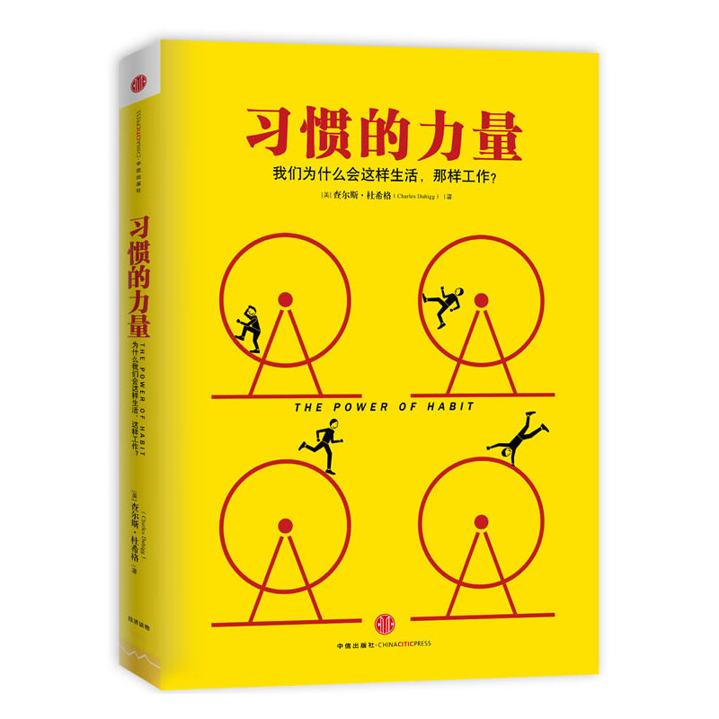

# 习惯的力量 #

|标　题|习惯的力量|
|----:|:-------|
|副标题|我们为什么会这样生活，那样工作？|
|原作名|[The Power of Habit](https://en.wikipedia.org/wiki/The_Power_of_Habit)|
|作　者|[(美)查尔斯·杜希格 Charles Duhigg](https://en.wikipedia.org/wiki/Charles_Duhigg)|
|译　者|吴奕俊 / 曹烨 |
|出版社|中信出版社|
|出版年|2013年3月|
|ISBN|9787508638010|
|推荐指数|★★★★☆|
 

## 目录 ##
+ 前言 习惯疗法
+ 第一部分 个体的习惯
    - 第一章 习惯回路 习惯是如何运作的
        * 某段记忆比另一段记忆更重要？
        * 暗示、惯常行为与奖赏
        * 习惯是脆弱的
        * 寻找幸福的能力
    - 第二章 大脑的渴求 如何建立新习惯
        * “白速得”与全民刷牙的习惯
        * “纺必适”的除异味策略
        * 满足潜意识的成就感
        * 渴求驱动习惯
    - 第三章 改变习惯的黄金法则 为什么习惯会发生变化
        * 海盗队：不是要创造新习惯，而是改变球员的旧习惯
        * 匿名戒酒社：是习惯还是成瘾？
        * 你眼睛看着哪里？
        * 习惯不能被消除，只能被替代
+ 第二部分 成功组织的习惯
    - 第四章 核心习惯 最重要的习惯
        * 什么是核心习惯？
        * 首先找到小成功
        * 建立能融入新价值观的文化
    - 第五章 星巴克和让人成功的习惯 让意志力变成自发意识
        * 意志力甚于好奇心
        * 当自律成为企业习惯
        * 关键时刻与惯例
        * 自主支配的机会
    - 第六章 危机就是转机 领导者怎样通过事故创造新习惯
        * 医疗事故与误诊：危险的习惯模式
        * 合理的平衡点
        * 重新分配责任
        * 抓住危机，重塑组织习惯
    - 第七章 连锁零售商预知消费者的行为 企业如何预测或操纵你的习惯
        * 如何预测哪些是怀孕的顾客？
        * 音乐行业：化生为熟
        * 用旧的习惯装扮新的内容
+ 第三部分 社会的习惯
    - 第八章 蒙哥马利公交车抵制运动 社会运动如何发生？
        * 熟人、社区与群体
        * 弱联系的力量
        * 灵性成长：习惯让精神丰满
    - 第九章 自由意志的神经学 我们是否要为我们的习惯负责？
        * 赌徒巴赫曼
        * 习惯的道德和选择
        * 诱惑、梦游症和瘾
        * 重塑习惯的社会责任
+ 附录 读者实践指南
+ 译者后记
